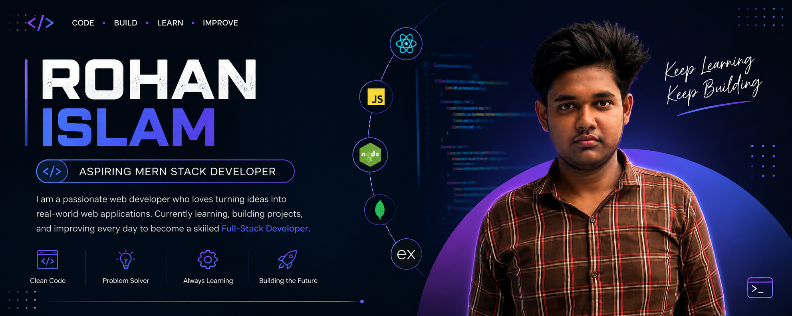

<!-- ==================== BANNER ==================== -->

  

<!-- ==================== INTRO ==================== -->

<h1 align="center">Hi 👋, I'm Rohan Islam</h1>

  

<!-- ==================== ABOUT ME ==================== -->

<h2>👨‍💻 About Me</h2>

<ul>
  <li>🚀 I'm currently working on <strong>Learning and building Web Development projects</strong></li>

  <li>🌱 I’m currently learning <strong>JavaScript, TypeScript, React</strong></li>

  <li>👯 I’m looking to collaborate on <strong>Frontend and Web Development projects</strong></li>

  <li>🤝 I’m looking for help with <strong>React and modern frontend development</strong></li>

  <li>
    👨‍💻 All of my projects are available at
    <a href="https://github.com/rohanislambd">
      <strong>GitHub</strong>
    </a>
  </li>

  <li>
    💬 Ask me about
    <strong>JavaScript, TypeScript, HTML, CSS, Tailwind CSS, Git & GitHub</strong>
  </li>

<li> 
  📫 How to reach me: 
  <a href="mailto:coderootbdofficial24@gmail.com"> 
    Gmail 
  </a> 
</li>

  <li>
    ⚡ Fun fact:
    <strong>I enjoy learning new technologies and building projects.</strong>
  </li>
</ul>

 

<!-- ==================== CONNECT WITH ME ==================== -->

<h2>🤝 Connect With Me</h2>

  

  

  

 

<!-- ==================== LANGUAGES & TOOLS ==================== -->

<h2>🛠️ Languages and Tools</h2>

<h3>Frontend</h3>

  

  

  

  

  

  

 

<h3>Backend & Database</h3>

  

  

<h3>Tools</h3>

  

  

  

 

<!-- ==================== GITHUB STREAK ==================== -->

<h2>🔥 GitHub Streak</h2>

  

 

<!-- ==================== CURRENT LEARNING ==================== -->

<h2>📚 Current Learning</h2>

<ul>
  <li>⚡ JavaScript</li>
  <li>🔷 TypeScript</li>
  <li>⚛️ React</li>
  <li>🎨 Modern CSS & Tailwind CSS</li>
  <li>🌐 Web Development</li>
</ul>

 

<!-- ==================== FOOTER ==================== -->

  

